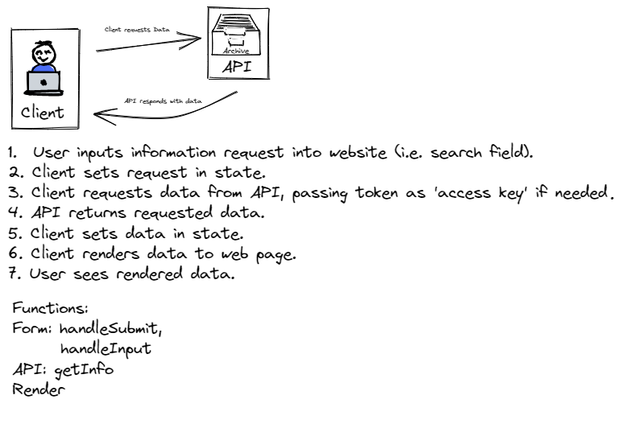

# City Explorer

**Author**: Amy Pierce
**Version**: 1.0.0

## Overview
<!-- Provide a high level overview of what this application is and why you are building it, beyond the fact that it's an assignment for this class. (i.e. What's your problem domain?) -->

## Getting Started
To duplicate this project, you will need to get an API key from Location IQ and install a .env file. It is recommended that you add the file to your .gitignore to keep the key private.

## Architecture
This application was built using html, JavaScript and CSS, primarily in the React framework, as well as React-BootStrap, AXIOS, and the Location IQ API

## Change Log
<!-- Use this area to document the iterative changes made to your application as each feature is successfully implemented. Use time stamps. Here's an example:

01-01-2001 4:59pm - Application now has a fully-functional express server, with a GET route for the location resource. -->

## Credit and Collaborations
Thanks to Sheyna Watkins and Shane Roach, for their instruction and assistance, as well as Alfredo Orquiz, Rhea Castillo, David Suy, Jeffery Smith and Jordan Yamada

Time Estimates:
For each of the lab features, make an estimate of the time it will take you to complete the feature, and record your start and finish times for that feature:

Name of feature: 1. Set Up
Estimate of time needed to complete: 1 hour

Start time: 4pm (meeting at 4:15)

Finish time: 12:50 pm

Actual time needed to complete: Not sure.

Name of feature: 2. Location

Estimate of time needed to complete: 1 hour_____

Start time: 4pm

Finish time: 11pm

Actual time needed to complete: 2 hours

Name of feature: 3 Map

Estimate of time needed to complete: 1 hour

Start time: 10am

Finish time: 12:30

Actual time needed to complete: 1 hour

Name of feature: 4. Error Handling

Estimate of time needed to complete: 30 minutes

Start time: 10am

Finish time: 12:30

Actual time needed to complete: 30 minutes.

So...I may have been coding during classtime. Sorry.

Time Estimates:
For each of the lab features, make an estimate of the time it will take you to complete the feature, and record your start and finish times for that feature:

Name of feature: ________________________________

Estimate of time needed to complete: _____

Start time: _____

Finish time: _____

Actual time needed to complete: _____